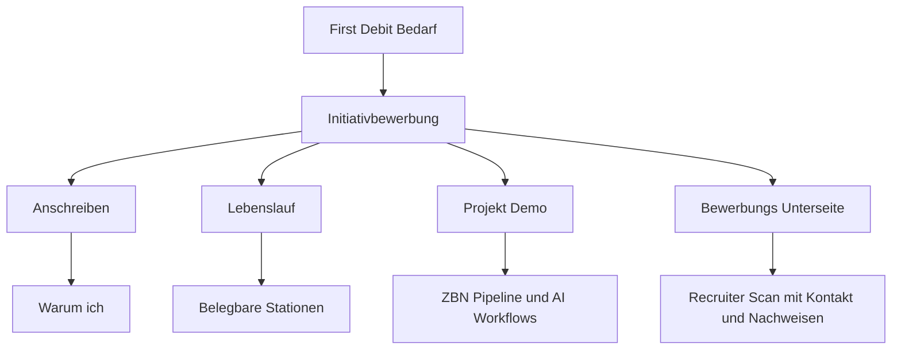

# Maximilian Unverricht - Website Content Extraction

## Index.html Content

<!DOCTYPE html>
<html lang="de">

<head>
    <meta charset="UTF-8">
    <meta name="viewport" content="width=device-width, initial-scale=1.0">
    <title>Maximilian Unverricht | Frontend Developer & Web Delivery</title>
    <meta name="description"
        content="Frontend Developer for websites, prototypes, and web delivery workflows | React, TypeScript, Vite, Cloudflare - Portfolio von Maximilian Unverricht">
    <meta property="og:image" content="maximilian-unverricht.pages.dev_.png">
    <!-- v3.0.5-CACHE-BUST -->
    
    <link
        href="https://fonts.googleapis.com/css2?family=Inter:wght@400;700&family=JetBrains+Mono:wght@400;500;700&display=swap"
        rel="stylesheet">
    
    
</head>

<body>
    

        

            <h1 class="boot-title">Maximilian
                Unverricht</h1>
            

                Frontend Developer & Web Delivery

            

                <a href="mailto:info@graphiks.de" class="boot-link">Kontakt</a>
                <a href="https://github.com/maexftw" target="_blank" rel="noopener noreferrer" class="boot-link">GitHub</a>
                <a href="Maximilian_Unverricht_Resume.html" class="boot-link">Lebenslauf</a>
            

            
[SEITE_WIRD_GELADEN]

            

        

    

    <noscript>
        

            <h1>Maximilian Unverricht</h1>
            
Frontend Developer & Web Delivery

            

                <a href="mailto:info@graphiks.de" class="boot-link">info@graphiks.de</a> |
                <a href="https://github.com/maexftw" class="boot-link">GitHub</a>
            

            
Please enable JavaScript to view the full site.

        

    </noscript>
    
    
</body>

</html>

## First Debit Anschreiben

<!DOCTYPE html>
<html lang="de">

<head>
    <meta charset="UTF-8" />
    <meta name="viewport" content="width=device-width, initial-scale=1.0" />
    <meta name="robots" content="noindex, nofollow, noarchive, nosnippet" />
    <title>Anschreiben – First Debit | Maximilian Unverricht</title>
    
</head>

<body>
    <article class="letter">
        
Initiativbewerbung · AI Automation & Web Umsetzung

        <header class="header">
            <h1>Maximilian Unverricht</h1>
            
Anschreiben für First Debit

            <ul class="contact-list">
                <li><strong>E-Mail:</strong> <a href="mailto:info@graphiks.de">info@graphiks.de</a> · <strong>Telefon:</strong> <a href="tel:+491633229892">+49 163 3229892</a></li>
                <li><strong>Portfolio:</strong> <a href="https://munverricht.org" target="_blank" rel="noopener noreferrer">https://munverricht.org</a></li>
            </ul>
        </header>

        <section class="meta" aria-label="Einordnung">
            
<strong>Ziel:</strong> Praktische KI-Umsetzung für datensensible interne Arbeitsprozesse

            
<strong>Schwerpunkt:</strong> Lokale LLMs, AI-Workflows, Web-Prototyping, Delivery

            
<strong>Relevante Phase:</strong> AI-Fokus seit 10/2025, Selbstständigkeitsfundament seit 2013

        </section>

        
Sehr geehrtes First-Debit-Team,

        
ich bewerbe mich initiativ bei Ihnen, weil ich genau an der Schnittstelle arbeite, die für ein datensensibles Unternehmen wie First Debit relevant sein kann: praktische KI-Anwendung, lokale LLM-Workflows, strukturierte Automation und schnelle Web-Umsetzung.

        
Mein Werdegang ist nicht der klassische Lebenslauf mit Ausbildung, Studium und vorgezeichneter KI-Karriere. Dafür bringe ich etwas anderes mit: langjährige Selbstständigkeit seit 2013, echte Delivery-Erfahrung im Live-Betrieb und seit 10/2025 einen klaren Fokus darauf, wie sich AI-gestützte Arbeitsweisen in reale, kontrollierbare Prozesse übersetzen lassen.

        
Was ich bei Ihnen einbringen kann, ist nicht nur allgemeines Interesse an KI, sondern eine sehr praktische Perspektive:

        <ul>
            <li>lokale LLM- und RAG-nahe Denkweisen für sensible Kontexte</li>
            <li>nachvollziehbare AI-Workflows statt bloßer Tool-Demos</li>
            <li>schnelle Oberflächen und Prototypen für interne Nutzung</li>
            <li>Web-Umsetzung, die Ideen direkt sichtbar und testbar macht</li>
        </ul>

        
Ich kann dabei besonders an den Punkten sinnvoll sein, an denen Technologie nicht als Selbstzweck eingeführt werden soll, sondern konkrete Arbeit erleichtern muss – etwa bei Wissenssystemen, Dokumentenunterstützung, internen Prüf- und Recherche-Workflows oder prototypischen Oberflächen für operative Teams.

        
Die letzten Monate habe ich bewusst genutzt, um meinen klassischen Web-Hintergrund mit AI-gestützter Umsetzung zu verbinden. Daraus sind nicht nur neue Ideen entstanden, sondern reale, vorzeigbare Artefakte: ein recruiter-taugliches Portfolio, dokumentierte AI-Use-Cases, lokale Workflow-Experimente mit praktischem Mehrwert und belastbare Delivery-Strecken bis zum Live-Deployment.

        
Meine frühere Selbstständigkeit mit WordPress, Webflow, Performance-Marketing und Kundenprojekten ist dabei kein Nebenthema, sondern das Fundament: Ich bin gewohnt, eigenverantwortlich zu arbeiten, Anforderungen pragmatisch zu übersetzen und Ergebnisse so zu bauen, dass sie außerhalb eines Demo-Kontexts funktionieren.

        
Ergänzend zu dieser Bewerbung habe ich eine eigene Bewerbungsseite für First Debit vorbereitet, auf der Sie Lebenslauf, Projektbelege und meine thematische Ausrichtung kompakt sehen können.

        
Mit freundlichen Grüßen Maximilian Unverricht

        
Dieses Anschreiben ist als sauber formatiertes HTML-Artefakt für Direktversand, Browser-Ansicht und PDF-Druck vorbereitet.

    </article>
</body>

</html>

## First Debit Bewerbung Plan

# First Debit – Bewerbungsplan

## Zielbild

Es entsteht ein kompaktes, zusammenhängendes Bewerbungspaket für eine **Initiativbewerbung** bei First Debit mit Fokus auf **AI, Automation und Web-Umsetzung**.

Das Paket besteht aus vier Bausteinen:

1. [`Anschreiben`](plans/First-Debit-Bewerbung-Plan.md)
2. [`Lebenslauf`](plans/First-Debit-Bewerbung-Plan.md)
3. [`Projekt-Demo`](plans/First-Debit-Bewerbung-Plan.md)
4. [`Bewerbungs-Unterseite`](plans/First-Debit-Bewerbung-Plan.md)

Wichtigste strategische Vorgabe:

- Kein generischer Standard-Lebenslauf
- Kein Fokus auf irrelevante frühe Stationen
- Stattdessen: **starker Beleg der letzten 6 Monate** plus belastbare Grundlage aus der Selbstständigkeit seit 2013
- Keine erfundene Spezialisierung, sondern saubere Darstellung dessen, was real vorhanden ist: **lokale LLMs, AI-Workflows, RAG-nahe Denkweise, Web-Delivery, iterative Umsetzung**

---

## Positionierung

### Kernbotschaft

Maximilian Unverricht verbindet langjährige praktische Web-Delivery mit einem neuen, real angewendeten AI-Arbeitsmodell.

Für First Debit ist die relevante Aussage nicht ein klassischer CV mit vielen Altstationen, sondern:

- jemand, der **AI nicht nur versteht, sondern in reale Arbeitsabläufe übersetzt**
- jemand, der **lokale Modelle, Datensensibilität und pragmatische Automation** zusammendenken kann
- jemand, der **Web-Prototypen, Oberflächen, interne Tools und verständliche Demos** schnell umsetzen kann
- jemand, der **ohne Konzern-Vokabular direkt lieferfähig** wirkt

### Empfohlener Zieltitel

Da es keine konkrete Ausschreibung gibt, wird die Bewerbung auf einen anschlussfähigen Zieltitel formuliert:

- **Initiativbewerbung AI Automation & Web Implementation**

Alternative intern für Textvarianten:

- **AI Workflow & Automation Specialist**
- **AI Prototyping & Web Delivery**
- **Praktische KI-Umsetzung für interne Tools und Workflows**

---

## Bewerbungsarchitektur

---

## Baustein 1 – Anschreiben

### Zweck

Das Anschreiben verkauft **nicht** einen klassischen Karriereweg, sondern die Passung für ein Unternehmen, das KI praktisch einsetzen will.

### Zielstruktur

1. **Direkter Einstieg**
   - Initiativbewerbung
   - Bezug auf First Debit als Inkasso-Unternehmen mit möglichem Bedarf an AI-gestützten Prozessen

2. **Warum passend**
   - Schnittstelle aus AI-Verständnis, lokalen LLMs, Workflow-Denken und Web-Umsetzung
   - Fähigkeit, Ideen nicht nur zu diskutieren, sondern sichtbar zu bauen

3. **Was konkret eingebracht werden kann**
   - interne Recherche- und Wissenssysteme
   - Dokumenten- und Prozessunterstützung
   - prototypische Oberflächen für Mitarbeiter-Workflows
   - nachvollziehbare Demo-Strecken statt theoretischer KI-Slides

4. **Warum der ungewöhnliche CV trotzdem passt**
   - Selbstständigkeit als Beleg für Eigenverantwortung, Umsetzungskraft und direkte Ergebnisorientierung
   - letztes halbes Jahr als eigentliche Relevanzzone für dieses Thema

5. **Call to action**
   - Verweis auf Unterseite und Demo
   - Gesprächsbereitschaft

### Tonalität

- direkt
- ruhig
- nicht anbiedernd
- nicht zu werblich
- fachlich greifbar
- ohne Buzzword-Überladung

---

## Baustein 2 – Lebenslauf

### Leitlinie

Der Lebenslauf wird **bewusst kompakt** gehalten und priorisiert Relevanz vor Vollständigkeitsritual.

### Empfohlene Struktur

1. **Kopfbereich**
   - Name
   - Ort
   - Kontakt
   - Portfolio

2. **Kurzprofil**
   - 3 bis 5 Zeilen
   - Fokus auf AI-Workflows, lokale LLMs, Web-Umsetzung, Selbstständigkeit als Delivery-Fundament

3. **Relevanteste Praxis**
   - **AI Workflow & Web Specialist** seit ca. 10/2025
   - Schwerpunkt auf letzte 6 Monate
   - keine falsche Datierung auf 2024

4. **Selbstständigkeit Graphiks.de**
   - 02/2013 bis 10/2025 als Hauptblock
   - Webdesign, WordPress, Webflow, Performance-Marketing, Conversion, Kundenbetrieb

5. **Zertifikate / Nachweise**
   - Google Ads
   - Google Analytics

6. **Bildung**
   - ehrlich und kurz
   - kein Studium, keine Ausbildung
   - nur vorhandener Schulabschluss, falls belastbar benennbar

7. **Optionaler Hinweis statt ausgeschmückter Alt-Historie**
   - früherer Werdegang auf Anfrage

### Lebenslauf-Prinzipien

- keine künstliche Aufblähung
- keine Rechtfertigungsprosa
- keine Lückenpanik
- Fokus auf **praktische Relevanz**
- letzte 6 Monate sichtbar stärker gewichten als frühe Jahre

---

## Baustein 3 – Projekt-Demo

### Hauptdemo

Die Demo sollte **nicht** wie ein allgemeines Portfolio wirken, sondern wie ein Beleg dafür, wie Maximilian für First Debit denken und bauen würde.

### Empfohlene Demo-Auswahl

#### A. ZBN Pipeline als Hauptbeleg

Darstellen als:

- Problem
- Ansatz
- Daten- und Modelllogik
- Nutzerwert
- Grenzen und Sorgfalt

Geplante Aussage:

- Verständnis für lokale LLM-Nutzung
- strukturierte Verarbeitung von Informationen
- Umgang mit sensiblen Inhalten und Datensouveränität
- Fähigkeit, komplexe AI-Logik in eine verständliche Anwendung zu übersetzen

#### B. Ergänzende Belege

- Portfolio-/Recruiter-Website als Beleg für schnelle Web-Delivery
- bestehende Kundenprojekte als Nachweis für Live-Betrieb und Verlässlichkeit
- AI-Agency-Workflow als Hinweis auf praktische Toolchain-Kompetenz

### Demo-Regel

Für First Debit ist **weniger, aber zielgenauer** besser als viele lose Projekte.

Empfehlung:

- 1 Hauptdemo
- 2 kurze Ergänzungsbelege
- jeweils im Muster **Problem → Lösung → Ergebnis**

---

## Baustein 4 – Bewerbungs-Unterseite

### Ziel

Eine dedizierte Seite für First Debit, damit die Bewerbung im Kopf bleibt und nicht nur wie ein PDF-Anhang wirkt.

### Inhaltsstruktur der Unterseite

1. **Hero**
   - Initiativbewerbung für First Debit
   - klare Ein-Zeilen-Positionierung
   - Direktlinks zu Kontakt, Lebenslauf, Demo

2. **Warum ich für dieses Thema relevant bin**
   - AI-Verständnis
   - lokale LLMs
   - Web-Umsetzung
   - pragmischer Delivery-Stil

3. **Was ich für First Debit konkret bauen könnte**
   - internes Wissenssystem
   - Dokumentenunterstützung
   - Recherche- und Prüf-Workflows
   - Prototypen für Sachbearbeitung oder Operations

4. **Beleg der letzten 6 Monate**
   - kurzer Leistungsblock
   - Tech und Systeme
   - reale Ergebnisse

5. **Projektbeweis**
   - ZBN Pipeline
   - 1 bis 2 weitere Cases

6. **Kurzlebenslauf auf der Seite**
   - reduzierte Timeline
   - Selbstständigkeit seit 2013
   - AI-Fokus seit 10/2025

7. **Kontaktabschluss**
   - Mail
   - Telefon
   - Lebenslauf Download

### UX-Regeln

- scanbar in unter 60 Sekunden
- klare Zwischenüberschriften
- keine Textwand
- kein allgemeines Portfolio-Wording
- sichtbarer Bezug zu First Debit

---

## Inhaltspriorität

### Was betont werden soll

- lokale LLMs und AI-Workflows
- Verständnis für datensensible Kontexte
- pragmatische Prototyping- und Umsetzungsfähigkeit
- Verbindung aus AI-Denken und Web-Delivery
- letztes halbes Jahr als relevante Transformationsphase

### Was nur Nebenrolle spielt

- alte, nicht themenrelevante Lebenslaufstationen
- klassische Designer-Selbstdarstellung
- umfangreiche Schulhistorie
- zu viele Einzelprojekte ohne Bezug zu First Debit

---

## Offene Fakten für die finale Textfassung

Diese Punkte müssen vor dem finalen Schreiben noch bestätigt werden:

1. exakter Start des AI-Fokus seit **10/2025**
2. genaue Formulierung des Schulabschlusses
3. ob **Google Analytics** als Zertifizierung formal belastbar genannt werden soll
4. welche 2 bis 3 Systeme neben der ZBN Pipeline gezeigt werden sollen
5. Ansprechpartner bei First Debit, falls auffindbar

---

## Empfohlene Umsetzung in Code Mode

1. Neue Bewerbungs-Unterseite als eigene Route oder klar abtrennbare Page innerhalb der bestehenden React-Struktur anlegen
2. Inhalte für First Debit separat textlich ausformulieren
3. Lebenslauftext in einer kompakten Fassung aktualisieren
4. Anschreiben als Markdown-Datei in [`plans/`](plans/First-Debit-Bewerbung-Plan.md) oder als exportierbares Textartefakt anlegen
5. Projektbeweise mit ZBN-Fokus in scanbarer Struktur ergänzen
6. Links zwischen Unterseite, Lebenslauf und Kontakt sauber verbinden

---

## Entscheidungsgrundlage

Die Bewerbung sollte **nicht** als klassischer Karriere-Nachweis verkauft werden, sondern als **Beleg praktischer AI-Umsetzungsfähigkeit mit starkem Selbstständigen-Fundament**.

Das ist für eine Initiativbewerbung bei First Debit die glaubwürdigste und strategisch sauberste Linie.

## Lebenslauf Maximilian Unverricht 2026

# Maximilian Unverricht – AI Workflow & Web Delivery (React/WordPress)

**Standort:** Dortmund (DE) · **Arbeitsmodell:** Remote / Hybrid  
**E-Mail:** info@munverricht.org · **Telefon:** +49 163 3229892  
**Portfolio:** https://munverricht.org

---

## Profil

Pragmatischer Web- und Workflow-Spezialist mit **12 Jahren Berufserfahrung** und Fokus auf AI-gestützte Delivery: schnelle Iterationen, saubere Implementierung, zuverlässiges Deployment. Ich kombiniere WordPress-/Webflow-Praxis mit React/TypeScript sowie lokalen RAG-/Inferenz-Workflows (Datensouveränität/Zero-Cloud). Meine Arbeitsweise: **AI-gestützte, iterative Umsetzung (Vibe-Coding mit Review/Testing/Deployment-Fokus)** – mit dem Ziel, live-fähige Ergebnisse statt Konzeptfolien zu liefern.

---

## Kernkompetenzen

**Tech**
- React, TypeScript, Vite
- Framer Motion, Anime.js
- Cloudflare Pages, Wrangler (Build/Release)

**AI & Workflow**
- Agentic Coding: Roo Code, Cline, Cursor, VS Code
- Google AI Studio / Stitch
- Local AI & RAG: Offline-Workflows, lokale Inferenz, Datensouveränität (Zero-Cloud)

**Growth**
- WordPress (10+ Jahre), Webflow (2 Jahre)
- SEO-Struktur, Google Ads, Analytics
- Conversion-orientierte Seiten- und UX-Struktur

---

## Berufserfahrung

### AI Workflow & Web Specialist / Creative Technologist (selbstständig)
**Dortmund · seit 10/2025**

- Aufbau und Dokumentation lokaler **Offline-RAG-Workflows** zur Dokumentanalyse (Zero-Cloud, Validierung, Datenkontrolle).
- Umsetzung moderner Web-Projekte mit **React/TypeScript/Vite** inkl. Deployment über Cloudflare Pages/Wrangler.
- Aufbau einer AI-gestützten Umsetzungspipeline (**Roo Code/Cline/Cursor/VS Code**): Prototyp → Review → produktionsnaher Stand.
- Kontinuierliche Optimierung von Portfolio/Positionierung (UX/Content/Performance) mit schnellen, iterativen Releases.

### Selbstständiger Webdesigner & Performance Marketer (Graphiks.de)
**Dortmund · 02/2013 – 08/2025 (freiberuflich), seitdem projektbasiert**

- Konzeption, Design, Umsetzung und Betrieb von KMU-Websites (WordPress; Webflow für schnelle Prototypen).
- Performance-Marketing: Google Ads Setup/Optimierung, Tracking/Analytics-Auswertung, Landingpages & Conversion-Struktur.
- SEO-nahe Strukturarbeit, technischer Betrieb (Performance/Stabilität) und kontinuierliche Content-Iteration.

---

## Projekt-Auszug

- **munverricht.org** – eigenes Portfolio für AI-Workflow & Web-Delivery (React/Vite, iterative Releases).  
  https://munverricht.org
- **Fitness Drensteinfurt** – Relaunch mit Lead-Gen-Fokus (Landing-Ansatz, schnelle Live-Iteration).  
  https://fitness-drensteinfurt-v2.pages.dev/
- **TriXstar Portfolio** – Artist-Portfolio als Vibe-Coding-Umsetzung (React/Vite/Cloudflare).  
  https://trixstar-portfolio.pages.dev/
- **Immo Netzwerk Portal** – Plattform-Prototyp im React-Umfeld (Dashboard/Concept).  
  https://immonetzwerkportal.pages.dev/
- **Kaffee Faensen Commerce** – Custom-Commerce-Logik mit Stripe-Integration und Conversion-Fokus.  
  https://www.kaffee-faensen.de/shop/homepage
- **Kost Sicherheitstechnik / Bockel-Bartscher** – laufende Unternehmensseiten im Live-Betrieb.  
  https://www.kost-sicherheitstechnik.de/ · https://www.bockel-bartscher.de/

---

## Bildung

- Schulabschluss kurz auf Anfrage spezifizierbar

---

## Zertifikate und Lizenzen

- Google Ads-Zertifizierung
- Führerschein Klasse B

## Leistungsbericht Bewerbung letzte 6 Monate

# Leistungsbericht (Bewerbungs-Version) – letzte 6 Monate

**Name:** Maximilian Unverricht  
**Zeitraum:** ca. 08/2025–02/2026  
**Stand:** 20.02.2026  
**Ziel:** Kompakte, recruiter-taugliche Zusammenfassung meiner Arbeit auf Basis der dokumentierten Inhalte in diesem Workspace.

---

## 1) Kurzprofil

Ich arbeite pragmatisch als „Vibe Coder“ mit klarem Ergebnisfokus: schnell umsetzen, sauber testen, live bringen, danach iterativ verbessern.  
Im letzten halben Jahr habe ich meinen klassischen Web-Hintergrund systematisch mit AI-gestützten Entwicklungs-Workflows verbunden.

---

## 2) Was ich in den letzten 6 Monaten gemacht habe

## A) Portfolio- und Positionierungs-Update umgesetzt
- Eigenes Portfolio als moderne React/TypeScript/Vite-Anwendung weiterentwickelt.
- Inhalte für Recruiter geschärft (klare Positionierung, konkrete Use-Cases, nachvollziehbare Projektauswahl).
- UX/Content iterativ verbessert statt „Big Bang“-Relaunch.

## B) Zwei klare AI-Use-Cases produktionsnah dokumentiert
- **Offline-RAG-Ansatz (ZBN-Kontext):** lokale Dokumentanalyse mit Fokus auf Datensouveränität und Validierung.
- **AI-Accelerated Agency Workflow:** KI-Generierung + menschliche Verfeinerung + deploymentfähige Kundenübergabe.

## C) Projekt-Delivery und Veröffentlichung stabilisiert
- Build/Deployment-Workflow über Cloudflare Pages etabliert und auf Live-Stand gebracht.
- Relevante Projekt-Referenzen konsolidiert (u. a. TriXstar, Immo-Netzwerk, Fitness, Kaffee Faensen, WordPress-Bestandsprojekte).

## D) Technische und inhaltliche Qualität nachgeschärft
- Performance-/UX-Optimierungen an zentralen Komponenten (u. a. Animation/Boot-Verhalten, visuelle Struktur).
- Inhalte sprachlich präzisiert (u. a. RAC→RAG-Korrekturen, Cases klarer beschrieben, Kontaktbereich vereinfacht).

## E) Bewerbungsunterlagen direkt aus dem Workflow heraus erstellt
- HTML-Lebenslauf als sofort nutzbares Artefakt erstellt, damit Profilinformationen direkt teilbar sind.

---

## 3) Systeme und Arbeitsmittel, mit denen ich praktisch gearbeitet habe

**Frontend & Delivery**
- React, TypeScript, Vite
- Framer Motion, Anime.js
- Cloudflare Pages, Wrangler

**AI- und Workflow-Ebene**
- Google AI Studio / Stitch (Generierungsanteil)
- Roo Code / Cline / VS Code (Umsetzung, Verfeinerung)
- Lokale Modellnutzung (u. a. Qwen/Mistral-Kontext laut Projektdokumentation)

**Methodik**
- Iteratives Arbeiten in kleinen Schritten
- Lokale Prüfung + schneller Feedback-Zyklus
- Dokumentierte Übergaben/Handoff-Logik

---

## 4) Projektauszug (relevante Arbeitsbeispiele)

- **Kaffee Faensen Commerce:** individuelle Shop-Logik + Stripe-Integration, Fokus auf kontrollierbare Conversion-Strecke.
- **TriXstar Portfolio:** modernes, schnell ausrollbares Portfolio-Setup.
- **Fitness Drensteinfurt Relaunch:** lokale Lead-Gen-/Marketing-Ausrichtung.
- **Immo Netzwerk Portal:** Plattform-Prototyping im React-Umfeld.
- **Kost Sicherheitstechnik / Bockel-Bartscher:** belastbare WordPress-Kundenarbeit aus dem Bestand.

---

## 5) Einordnung meiner Vorerfahrung (kompakt)

- **10 Jahre WordPress:** Kundenprojekte von Konzeption bis Live-Betrieb, inkl. technischer Betreuung und Marketingbezug.
- **2 Jahre Webflow:** schnelle Prototypen, visuelle Umsetzung und strukturierte Inhaltsarchitektur.

Diese Vorerfahrung ist die Basis dafür, dass ich neue AI-Workflows nicht nur „zeige“, sondern praktisch in reale Web- und Kundenkontexte übersetze.

---

## 6) Meine Arbeitsweise in einem Satz

Ich kombiniere langjährige Web-/Marketing-Praxis mit AI-gestützter Umsetzung und liefere nachvollziehbare, live-fähige Ergebnisse statt reiner Konzeptfolien.

---

## 7) Antwortbaustein für Rückfragen („Was haben Sie im letzten halben Jahr gemacht?“)

„Ich habe mein Arbeitsmodell auf AI-gestützte Web-Delivery umgestellt und dafür mein Portfolio sowie mehrere Kunden-/Case-Strecken praktisch umgesetzt. Konkret: moderne React/Vite-Umsetzungen, klare Deployments über Cloudflare, dokumentierte AI-Workflows (u. a. Offline-RAG und Agentur-Workflow) und parallel weiterhin nutzbare Kundenarbeit aus meinem WordPress/Webflow-Fundament. Wichtig war mir dabei immer: pragmatisch liefern, sauber nachschärfen, Ergebnisse sichtbar machen.“

---

## 8) Evidenzbasis im Workspace (Auszug)

- Handoff-/Session-Log mit konkreten Änderungen: `agents.md`
- Projektzusammenfassung und Arbeitsprinzipien: `README.md`
- Portfolio-Struktur und Sektionen: `App.tsx`
- Positionierung/Tooling im Hero-Bereich: `components/Hero.tsx`
- Chronologie & Erfahrungseinordnung: `components/Evolution.tsx`
- Offline-RAG-Use-Case: `components/ShowcaseA.tsx`
- AI-Agency-Workflow + Commerce-Case: `components/ShowcaseB.tsx`
- Projektarchiv (Referenzen): `components/Projects.tsx`
- Capability-/Tool-Matrix: `components/SkillMonitor.tsx`
- HTML-Lebenslauf-Artefakt: `public/Maximilian_Unverricht_Resume.html`

Hinweis: Dieser Bericht ist bewusst faktennah und auf nachweisbare Inhalte im aktuellen Ordnerstand begrenzt.

## Kurzversion 1 Seite

# Kurzversion (1 Seite) – Was ich im letzten halben Jahr gemacht habe

**Maximilian Unverricht**  
**Zeitraum:** letzte 6 Monate (ca. 08/2025–02/2026)  

Ich habe in den letzten Monaten meinen klassischen Web-Hintergrund gezielt mit AI-gestützten Workflows verbunden und in konkrete, live-fähige Ergebnisse überführt.

## Fokus der letzten 6 Monate

- Portfolio und Positionierung für Recruiter/Kunden praktisch umgesetzt und iterativ geschärft.
- Moderne Frontend-Strecken mit React, TypeScript und Vite aufgebaut, getestet und deployed.
- AI-gestützte Arbeitsweise in reale Delivery-Prozesse übersetzt (nicht nur prototypisch, sondern mit nutzbarer Struktur).
- Konkrete Case-Kommunikation aufgebaut: Offline-RAG-Ansatz + AI-Accelerated Agency Workflow.
- Projekt- und Referenzdarstellung konsolidiert (inkl. klassischer Kundenprojekte + neuer AI-/Vibe-Coding-Strecken).

## Konkrete Ergebnisse

- **Recruiter-fähige Website-Basis** mit klaren Sektionen zu Werdegang, Use Cases, Projekten und Skill-Matrix.
- **Stabiler Delivery-Stack** inkl. Build/Deployment über Cloudflare Pages.
- **Inhaltlicher Feinschliff** (präzisere Formulierungen, klare Cases, vereinfachte Kontaktstrecke).
- **Direkt nutzbares Bewerbungsartefakt** als HTML-Lebenslauf.

## Womit ich gearbeitet habe

- **Web/Frontend:** React, TypeScript, Vite, Framer Motion, Anime.js
- **Delivery:** Cloudflare Pages, Wrangler, GitHub
- **AI-Workflow:** Google AI Studio/Stitch, Roo Code/Cline/VS Code, lokale Modell-/RAG-Kontexte

## Einordnung meiner Erfahrung

- **10 Jahre WordPress** (Kundenprojekte, Betrieb, technische Betreuung, Marketingbezug)
- **2 Jahre Webflow** (visuelle Umsetzung, Prototyping, schnelle Content-Iteration)

## Arbeitsstil

Pragmatisch, schnell, iterativ: Ich arbeite in kleinen, nachvollziehbaren Schritten, teste früh und liefere sichtbare Ergebnisse statt langer Konzeptphasen.

## Kurzantwort für Interviews

„Ich habe mein Delivery-Modell in den letzten sechs Monaten konsequent auf AI-unterstützte Web-Umsetzung erweitert: moderne React/Vite-Projekte gebaut, sauber deployed, Inhalte recruiter-tauglich geschärft und klare Use Cases dokumentiert. Gleichzeitig nutze ich weiterhin mein langjähriges WordPress-/Webflow-Fundament, um schnell und zuverlässig in echte Kundenkontexte zu liefern.“