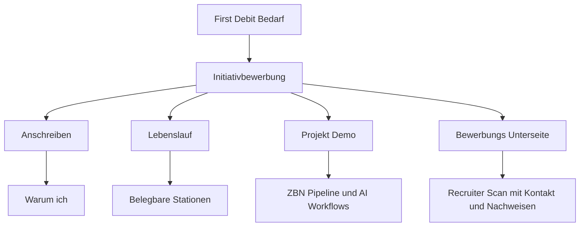

# First Debit – Bewerbungsplan

## Zielbild

Es entsteht ein kompaktes, zusammenhängendes Bewerbungspaket für eine **Initiativbewerbung** bei First Debit mit Fokus auf **AI, Automation und Web-Umsetzung**.

Das Paket besteht aus vier Bausteinen:

1. [`Anschreiben`](plans/First-Debit-Bewerbung-Plan.md)
2. [`Lebenslauf`](plans/First-Debit-Bewerbung-Plan.md)
3. [`Projekt-Demo`](plans/First-Debit-Bewerbung-Plan.md)
4. [`Bewerbungs-Unterseite`](plans/First-Debit-Bewerbung-Plan.md)

Wichtigste strategische Vorgabe:

- Kein generischer Standard-Lebenslauf
- Kein Fokus auf irrelevante frühe Stationen
- Stattdessen: **starker Beleg der letzten 6 Monate** plus belastbare Grundlage aus der Selbstständigkeit seit 2013
- Keine erfundene Spezialisierung, sondern saubere Darstellung dessen, was real vorhanden ist: **lokale LLMs, AI-Workflows, RAG-nahe Denkweise, Web-Delivery, iterative Umsetzung**

---

## Positionierung

### Kernbotschaft

Maximilian Unverricht verbindet langjährige praktische Web-Delivery mit einem neuen, real angewendeten AI-Arbeitsmodell.

Für First Debit ist die relevante Aussage nicht ein klassischer CV mit vielen Altstationen, sondern:

- jemand, der **AI nicht nur versteht, sondern in reale Arbeitsabläufe übersetzt**
- jemand, der **lokale Modelle, Datensensibilität und pragmatische Automation** zusammendenken kann
- jemand, der **Web-Prototypen, Oberflächen, interne Tools und verständliche Demos** schnell umsetzen kann
- jemand, der **ohne Konzern-Vokabular direkt lieferfähig** wirkt

### Empfohlener Zieltitel

Da es keine konkrete Ausschreibung gibt, wird die Bewerbung auf einen anschlussfähigen Zieltitel formuliert:

- **Initiativbewerbung AI Automation & Web Implementation**

Alternative intern für Textvarianten:

- **AI Workflow & Automation Specialist**
- **AI Prototyping & Web Delivery**
- **Praktische KI-Umsetzung für interne Tools und Workflows**

---

## Bewerbungsarchitektur

---

## Baustein 1 – Anschreiben

### Zweck

Das Anschreiben verkauft **nicht** einen klassischen Karriereweg, sondern die Passung für ein Unternehmen, das KI praktisch einsetzen will.

### Zielstruktur

1. **Direkter Einstieg**
   - Initiativbewerbung
   - Bezug auf First Debit als Inkasso-Unternehmen mit möglichem Bedarf an AI-gestützten Prozessen

2. **Warum passend**
   - Schnittstelle aus AI-Verständnis, lokalen LLMs, Workflow-Denken und Web-Umsetzung
   - Fähigkeit, Ideen nicht nur zu diskutieren, sondern sichtbar zu bauen

3. **Was konkret eingebracht werden kann**
   - interne Recherche- und Wissenssysteme
   - Dokumenten- und Prozessunterstützung
   - prototypische Oberflächen für Mitarbeiter-Workflows
   - nachvollziehbare Demo-Strecken statt theoretischer KI-Slides

4. **Warum der ungewöhnliche CV trotzdem passt**
   - Selbstständigkeit als Beleg für Eigenverantwortung, Umsetzungskraft und direkte Ergebnisorientierung
   - letztes halbes Jahr als eigentliche Relevanzzone für dieses Thema

5. **Call to action**
   - Verweis auf Unterseite und Demo
   - Gesprächsbereitschaft

### Tonalität

- direkt
- ruhig
- nicht anbiedernd
- nicht zu werblich
- fachlich greifbar
- ohne Buzzword-Überladung

---

## Baustein 2 – Lebenslauf

### Leitlinie

Der Lebenslauf wird **bewusst kompakt** gehalten und priorisiert Relevanz vor Vollständigkeitsritual.

### Empfohlene Struktur

1. **Kopfbereich**
   - Name
   - Ort
   - Kontakt
   - Portfolio

2. **Kurzprofil**
   - 3 bis 5 Zeilen
   - Fokus auf AI-Workflows, lokale LLMs, Web-Umsetzung, Selbstständigkeit als Delivery-Fundament

3. **Relevanteste Praxis**
   - **AI Workflow & Web Specialist** seit ca. 10/2025
   - Schwerpunkt auf letzte 6 Monate
   - keine falsche Datierung auf 2024

4. **Selbstständigkeit Graphiks.de**
   - 02/2013 bis 10/2025 als Hauptblock
   - Webdesign, WordPress, Webflow, Performance-Marketing, Conversion, Kundenbetrieb

5. **Zertifikate / Nachweise**
   - Google Ads
   - Google Analytics

6. **Bildung**
   - ehrlich und kurz
   - kein Studium, keine Ausbildung
   - nur vorhandener Schulabschluss, falls belastbar benennbar

7. **Optionaler Hinweis statt ausgeschmückter Alt-Historie**
   - früherer Werdegang auf Anfrage

### Lebenslauf-Prinzipien

- keine künstliche Aufblähung
- keine Rechtfertigungsprosa
- keine Lückenpanik
- Fokus auf **praktische Relevanz**
- letzte 6 Monate sichtbar stärker gewichten als frühe Jahre

---

## Baustein 3 – Projekt-Demo

### Hauptdemo

Die Demo sollte **nicht** wie ein allgemeines Portfolio wirken, sondern wie ein Beleg dafür, wie Maximilian für First Debit denken und bauen würde.

### Empfohlene Demo-Auswahl

#### A. ZBN Pipeline als Hauptbeleg

Darstellen als:

- Problem
- Ansatz
- Daten- und Modelllogik
- Nutzerwert
- Grenzen und Sorgfalt

Geplante Aussage:

- Verständnis für lokale LLM-Nutzung
- strukturierte Verarbeitung von Informationen
- Umgang mit sensiblen Inhalten und Datensouveränität
- Fähigkeit, komplexe AI-Logik in eine verständliche Anwendung zu übersetzen

#### B. Ergänzende Belege

- Portfolio-/Recruiter-Website als Beleg für schnelle Web-Delivery
- bestehende Kundenprojekte als Nachweis für Live-Betrieb und Verlässlichkeit
- AI-Agency-Workflow als Hinweis auf praktische Toolchain-Kompetenz

### Demo-Regel

Für First Debit ist **weniger, aber zielgenauer** besser als viele lose Projekte.

Empfehlung:

- 1 Hauptdemo
- 2 kurze Ergänzungsbelege
- jeweils im Muster **Problem → Lösung → Ergebnis**

---

## Baustein 4 – Bewerbungs-Unterseite

### Ziel

Eine dedizierte Seite für First Debit, damit die Bewerbung im Kopf bleibt und nicht nur wie ein PDF-Anhang wirkt.

### Inhaltsstruktur der Unterseite

1. **Hero**
   - Initiativbewerbung für First Debit
   - klare Ein-Zeilen-Positionierung
   - Direktlinks zu Kontakt, Lebenslauf, Demo

2. **Warum ich für dieses Thema relevant bin**
   - AI-Verständnis
   - lokale LLMs
   - Web-Umsetzung
   - pragmischer Delivery-Stil

3. **Was ich für First Debit konkret bauen könnte**
   - internes Wissenssystem
   - Dokumentenunterstützung
   - Recherche- und Prüf-Workflows
   - Prototypen für Sachbearbeitung oder Operations

4. **Beleg der letzten 6 Monate**
   - kurzer Leistungsblock
   - Tech und Systeme
   - reale Ergebnisse

5. **Projektbeweis**
   - ZBN Pipeline
   - 1 bis 2 weitere Cases

6. **Kurzlebenslauf auf der Seite**
   - reduzierte Timeline
   - Selbstständigkeit seit 2013
   - AI-Fokus seit 10/2025

7. **Kontaktabschluss**
   - Mail
   - Telefon
   - Lebenslauf Download

### UX-Regeln

- scanbar in unter 60 Sekunden
- klare Zwischenüberschriften
- keine Textwand
- kein allgemeines Portfolio-Wording
- sichtbarer Bezug zu First Debit

---

## Inhaltspriorität

### Was betont werden soll

- lokale LLMs und AI-Workflows
- Verständnis für datensensible Kontexte
- pragmatische Prototyping- und Umsetzungsfähigkeit
- Verbindung aus AI-Denken und Web-Delivery
- letztes halbes Jahr als relevante Transformationsphase

### Was nur Nebenrolle spielt

- alte, nicht themenrelevante Lebenslaufstationen
- klassische Designer-Selbstdarstellung
- umfangreiche Schulhistorie
- zu viele Einzelprojekte ohne Bezug zu First Debit

---

## Offene Fakten für die finale Textfassung

Diese Punkte müssen vor dem finalen Schreiben noch bestätigt werden:

1. exakter Start des AI-Fokus seit **10/2025**
2. genaue Formulierung des Schulabschlusses
3. ob **Google Analytics** als Zertifizierung formal belastbar genannt werden soll
4. welche 2 bis 3 Systeme neben der ZBN Pipeline gezeigt werden sollen
5. Ansprechpartner bei First Debit, falls auffindbar

---

## Empfohlene Umsetzung in Code Mode

1. Neue Bewerbungs-Unterseite als eigene Route oder klar abtrennbare Page innerhalb der bestehenden React-Struktur anlegen
2. Inhalte für First Debit separat textlich ausformulieren
3. Lebenslauftext in einer kompakten Fassung aktualisieren
4. Anschreiben als Markdown-Datei in [`plans/`](plans/First-Debit-Bewerbung-Plan.md) oder als exportierbares Textartefakt anlegen
5. Projektbeweise mit ZBN-Fokus in scanbarer Struktur ergänzen
6. Links zwischen Unterseite, Lebenslauf und Kontakt sauber verbinden

---

## Entscheidungsgrundlage

Die Bewerbung sollte **nicht** als klassischer Karriere-Nachweis verkauft werden, sondern als **Beleg praktischer AI-Umsetzungsfähigkeit mit starkem Selbstständigen-Fundament**.

Das ist für eine Initiativbewerbung bei First Debit die glaubwürdigste und strategisch sauberste Linie.
